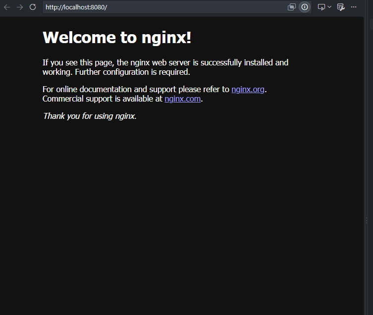
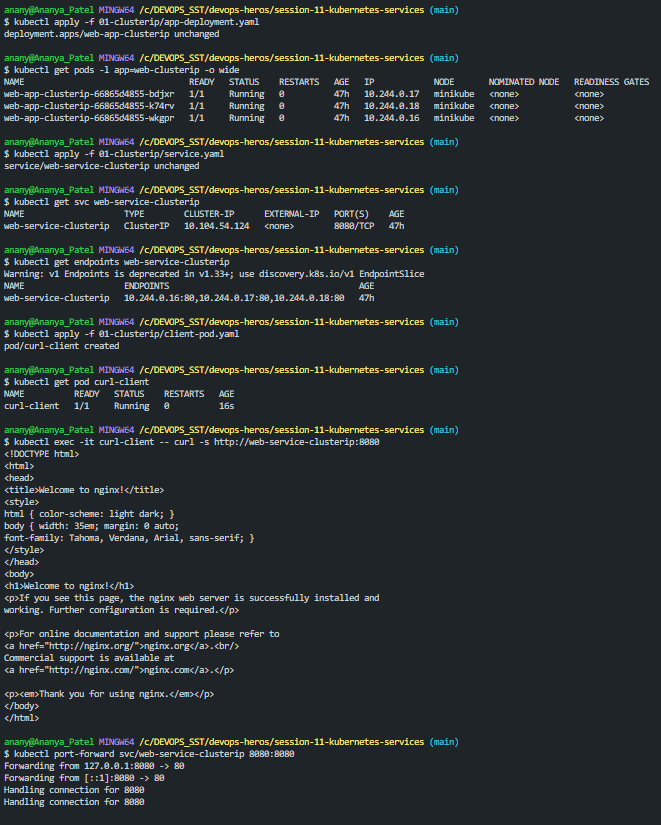

##### Explanation :
  A clusterIP service provides a stable internal IP address and DNS name for a group of pods selected by labels, allowing applications inside the kubernetes cluster to communicate with those pods without depending on their changing PODS IP

- It is mainly used for internal communicatin between services .
**(Frontend_Pod -> Cluster_IP_Service -> Backend_Pods)**
- AS pod_IP are temp , so the communication can break because of this  , so service IP stays stable and is a cure for this.
- Service can find pods by the help of labels and selectors
- We can use COREDNS instead of IP as , coreDNS resolves service_name to its cluster_IP.

### IMAGES:

#### Live:

#### Terminal:
