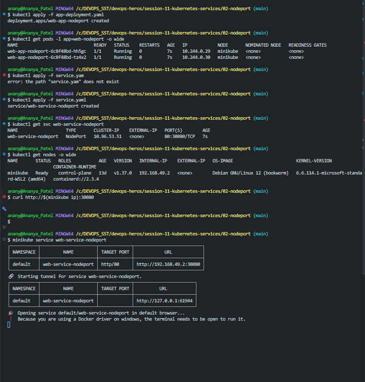

## Explanation :

- Nodeport is a kubernetes service type used to make an applicaion accesible form outside  the cluster through a worker node_IP + port.
***(External_Client -> Node_IP : NodePort -> NodePort_Service -> Backend_Port)***
- ex : http://192.168.49.2:30080
 here , Node_IP - 192.168.49.2
        Node_Port - 30080

- ClusterIp is accessible only inside the cluster  , but NodePort exposes the services through a port on the worker node.

##### Basically , NodePort gives an external client a way to enter the cluster through the **NodeIP:NodePort** , while the service takes care of sending that traffic to the appropriate pod.

## Images :
  ### LIVE :
  

  ### Terminal :
  
