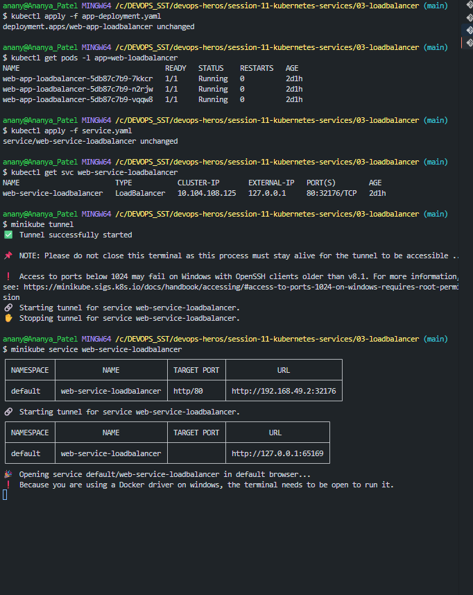
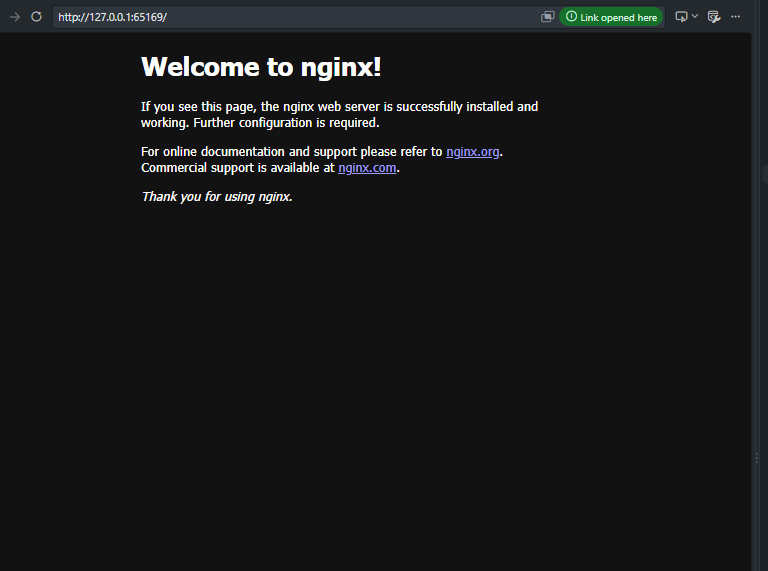

### Explanation :
A load balancer is a kubernetes service type used to expose an application to the outside world , mainly in cloud enviroments.
Ex - AWS EKE , Azure AKS...

###### Flow:
User -> Cloud Load Balancer -> Kubenetes Services -> Backend pods

*** Basicaly , loadbalancer helps in distributing the traffic.***

### Images :

