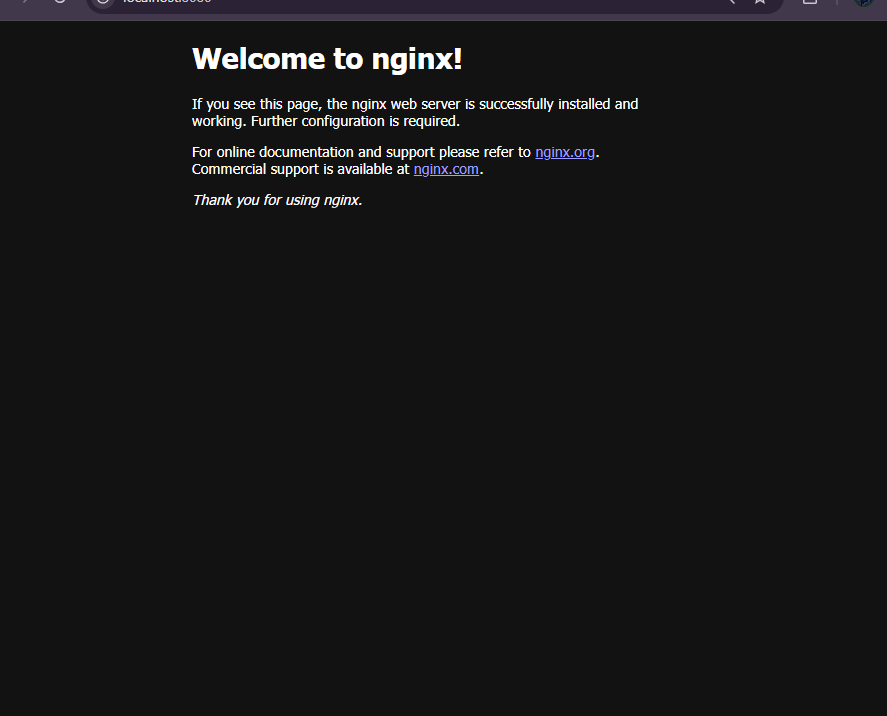
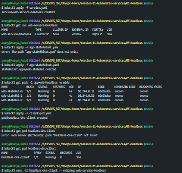
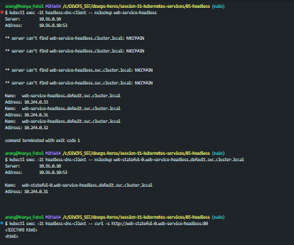
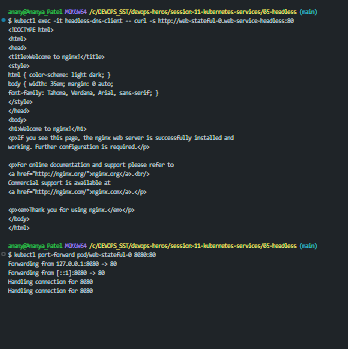

## Explanation :
A **Headless Service** is a kubernetes service that doesn't get a clusterIP.

- ***Normal Service*** :
   - client -> ClusterIP -> Pod_1 / Pod_2 /Pod_3

- ***HeadLess Service*** :
    - client -> DNS -> Pod_1/ Pod_2 /Pod_3.

Normal service gives us one virtual IP , and Headless Service gives you the individual pod IPs through DNS.

- In , normal client with which pod is it communicating( ***perfect for stateless appplications***) , but when we need to know we use Headless Service.

##### Here , we don't have cluster IP

- Here , we use **kind:StatefulSet** instead of **kind:dDeployment** , coz statefulset gives pods stable identities.

## Images:
#### Live :

#### Terminal :

