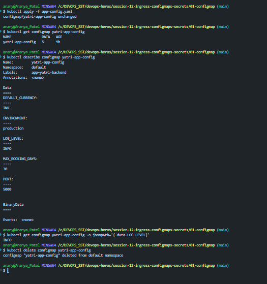

## Explanation :

### ConfigMap :
 - It is an object which stores the non-sensitive configuration separately from your application .

 ***(Docker_Img -> Application_Code -> Config_Map -> Configuration)***
 - We can use the same docker image in Dev , Staging , Production with diff configuration .

### Images :
