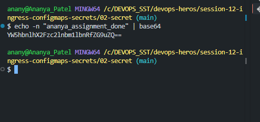

## Explanation :
   - A SECRET is a kubernetes object used to store sensitive data (complete opposite of configmap).
   - ex : passwords , API_Keys , Tokens , DB_Credentials
   - Kbernetes Secrets are not automatically secure simply because they're called Secrets.

   ##### Base64 is simply an encoding agent.

   #### Images :
   
